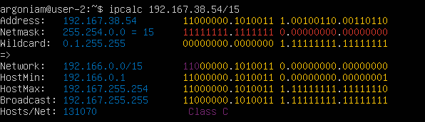

# Сети в Linux

## Part 1. Инструмент ipcalc

### 1.1. Сети и маски

1. Чтобы определить адрес сети `192.167.38.54/13` используем команду `ipcalc`:

|  |
| :-----------------------------------------------------------------: |
|                        _Рис. 1. Адрес сети_                         |

- Адрес сети: `192.167.38.54`

2. Перевод маски `255.255.255.0` в префиксную и двоичную запись:

|  |
| :----------------------------------------------------------------------------------: |
|                _Рис. 2. Перевод маски в префиксную и двоичную запись_                |

- Префиксная запись: `24`
- Двоичная запись: `11111111.11111111.11111111.00000000`

Перевод маски `/15` в обычную и двоичную запись:

|  |
| :-----------------------------------------------------------------------------------: |
|                  _Рис. 3. Перевод маски в обычную и двоичную запись_                  |

- Обычная запись: `255.254.0.0`
- Двоичная запись: `11111111.11111110.00000000.00000000`

Перевод маски `11111111.11111111.11111111.11110000` в обычную и префиксную запись:

|  |
| :-----------------------------------------------------------------------------------: |
|                 _Рис. 4. Перевод маски в обычную и префиксную запись_                 |

- Обычная запись: `255.255.255.0`
- Префиксная запись: `24`

3. Определение максимального и минимального хоста в сети `12.167.38.4` для маски `/8`:

|  |
| :------------------------------------------------------------------------------------------------------------: |
|                               _Рис. 5. Максимальный/Минимальный хост для маски_                                |

- HostMin: `12.0.0.1`
- HostMax: `12.255.255.254`

Определение максимального и минимального хоста в сети `12.167.38.4` для маски `11111111.11111111.00000000.00000000`:

|  |
| :-------------------------------------------------------------------------------------------------------------: |
|                                _Рис. 6. Максимальный/Минимальный хост для маски_                                |

- HostMin: `12.167.38.1`
- HostMax: `12.167.38.254`

Определение максимального и минимального хоста в сети `12.167.38.4` для маски `255.255.254.0`:

|  |
| :-------------------------------------------------------------------------------------------------------------: |
|                                _Рис. 7. Максимальный/Минимальный хост для маски_                                |

- HostMin: `12.167.38.1`
- HostMax: `12.167.39.254`

Определение максимального и минимального хоста в сети `12.167.38.4` для маски `/4`:

|  |
| :----------------------------------------------------------------------------------------------------------------: |
|                                 _Рис. 8. Максимальный/Минимальный хост для маски_                                  |

- HostMin: `0.0.0.1`
- HostMax: `15.255.255.254`

---

### 1.2. localhost

Проверим `194.34.23.100` с помощью `ipcalc`:

|  |
| :-----------------------------------------------------------------------------------------: |
|                   _Рис. 9. Вывод информации о первом хосте (не подходит)_                   |

Проверим `127.0.0.2` с помощью `ipcalc`:

|  |
| :------------------------------------------------------------------------------------------: |
|                    _Рис. 10. Вывод информации о втором хосте (подходит)_                     |

Проверим `127.1.0.1` с помощью `ipcalc`:

|  |
| :-----------------------------------------------------------------------------------------: |
|                   _Рис. 11. Вывод информации о третьем хосте (подходит)_                    |

Проверим `128.0.0.1` с помощью `ipcalc`:

|  |
| :-----------------------------------------------------------------------------------------: |
|                 _Рис. 12. Вывод информации о четвертом хосте (не подходит)_                 |

---

### 1.3. Диапазоны и сегменты сетей

1. Публичные IP-адреса:

|  |
| :-----------------------------------------------------------------------------: |
|                            _Рис. 13. Публичный хост_                            |

|  |
| :-----------------------------------------------------------------------------: |
|                            _Рис. 14. Публичный хост_                            |

|  |
| :-----------------------------------------------------------------------------: |
|                            _Рис. 15. Публичный хост_                            |

|  |
| :-----------------------------------------------------------------------------: |
|                            _Рис. 16. Публичный хост_                            |

|  |
| :------------------------------------------------------------------------------: |
|                            _Рис. 17. Публичный хост_                             |

Частные IP-адреса:

|  |
| :-----------------------------------------------------------------------------: |
|                             _Рис. 18. Частный хост_                             |

|  |
| :-----------------------------------------------------------------------------: |
|                             _Рис. 19. Частный хост_                             |

|  |
| :-----------------------------------------------------------------------------: |
|                             _Рис. 20. Частный хост_                             |

|  |
| :-----------------------------------------------------------------------------: |
|                             _Рис. 21. Частный хост_                             |

|  |
| :-----------------------------------------------------------------------------: |
|                             _Рис. 22. Частный хост_                             |

2. Учитывая значенич `HostMin` и `HostMax` для сети, доступны следующие IP адреса:

- `10.10.0.2`
- `10.10.10.10`
- `10.10.1.255`

|  |
| :-------------------------------------------------------------------------------------: |
|              _Рис. 23. Информация Максимальный/Минимальный хост для сети_               |

## Part 2. Статическая маршрутизация между двумя машинами

|  |
| :-----------------------------------------------------------------------------------------------------------------: |
|                                      _Рис. 24. Работа двух виртуальных машин_                                       |

Чтобы посмотреть существующие сетевые интерфейсы используем команду `ip a`:

|  |
| :----------------------------------------------------------------------------------: |
|                        _Рис. 25. Сетевые интерфейсы для ws1_                         |

|  |
| :----------------------------------------------------------------------------------: |
|                        _Рис. 26. Сетевые интерфейсы для ws2_                         |

---

Чтобы задать нужные адреса и маски для каждой из машин, воспользуемся командой: `sudo nano ../../etc/netplan/00-installer-config.yaml`

|  |
| :-------------------------------------------------------------------------------------: |
|                             _Рис. 27. Измененный файл ws1_                              |

|  |
| :-------------------------------------------------------------------------------------: |
|                             _Рис. 28. Измененный файл ws2_                              |

---

|  |
| :-------------------------------------------------------------------------------------------: |
|                              _Рис. 29. Применение изменений ws1_                              |

|  |
| :--------------------------------------------------------------------------------------------: |
|                              _Рис. 30. Применение изменений ws2_                               |

---

### 2.1. Добавление статического маршрута вручную

|  |
| :------------------------------------------------------------------------------------------------------------: |
|                                  _Рис. 31. Добавление статического маршрута_                                   |

|  |
| :------------------------------------------------------------------------------------------------------------: |
|                                  _Рис. 32. Добавление статического маршрута_                                   |

Пропингуем связь между машинами, чтобы проверить корректность добавления статического маршрута:

|  |
| :----------------------------------------------------------: |
|      _Рис. 33. Проверка соединения с помощью ping(ws1)_      |

|  |
| :----------------------------------------------------------: |
|      _Рис. 34. Проверка соединения с помощью ping(ws2)_      |

---

### 2.2. Добавление статического маршрута с сохранением

Добавим статический маршрут от одной машины к другой с помощью файла `/etc/netplan/00-installer-config.yaml`:

|  |
| :--------------------------------------------------------------------------------------------------------------------------------: |
|                                   _Рис. 35. Добавление статического маршрута с сохранением ws1_                                    |

|  |
| :--------------------------------------------------------------------------------------------------------------------------------: |
|                                   _Рис. 36. Добавление статического маршрута с сохранением ws2_                                    |

Пропингуем соединение между машинами:

|  |
| :---------------------------------------------------------------------------------------------------: |
|                          _Рис. 37. Проверка соединения с помощью ping(ws1)_                           |

|  |
| :---------------------------------------------------------------------------------------------------: |
|                          _Рис. 38. Проверка соединения с помощью ping(ws2)_                           |

---

## Part 3. Утилита iperf3

### 3.1. Скорость соединения

8 Mbps = 1 MB/s
100 MB/s = 819200 Kbps
1 Gbps = 1024 Mbps

---

### 3.2. Утилита iperf3

Назначим в качестве клиента `ws1`:

|  |
| :--------------------------------------------------------------------------------: |
|                               _Рис. 39. iperf3 ws1_                                |

А `ws2` назначим в качестве севера:

|  |
| :--------------------------------------------------------------------------------: |
|                               _Рис. 40. iperf3 ws2_                                |

---

## Part 4. Сетевой экран

### 4.1. Утилита iptables

|  |
| :--------------------------------------------------------------------------------------------------: |
|                                       _Рис. 41. iptables ws1_                                        |

|  |
| :--------------------------------------------------------------------------------------------------: |
|                                       _Рис. 42. iptables ws2_                                        |

Чтобы запустить файлы на обеих машинах воспользуемся командами `sudo chmod +x /ect/firewall.sh` и `sudo /etc/firewall.sh`:

|  |
| :-----------------------------------------------------------------------------------: |
|                               _Рис. 43. start firewall_                               |

- Разница между стратегиями заключается в том, что в первом файле первым подходящим правилом для пакета является запрет, а во втором - разрешение. Применяется только первое подходящее правило, остальные игнорируются.

---

### 4.2. Утилита nmap

- `ping` с `ws1` на `ws2`:

|  |
| :---------------------------------------------------------------------------: |
|                            _Рис. 44. nmap для ws2_                            |

- `ping` с `ws2` на `ws1`:

|  |
| :---------------------------------------------------------------------------: |
|                            _Рис. 45. nmap для ws2_                            |

- `nmap` для `ws2`:

|  |
| :----------------------------------------------------------------------: |
|                         _Рис. 46. nmap для ws2_                          |

---

## Part 5. Статическая маршрутизация сети

### 5.1. Настройка адресов машин

- `ws11`:

|  |
| :-------------------------------------------------------------------------: |
|                    _Рис. 47. installer-config для ws11_                     |

- `ws21`:

|  |
| :-------------------------------------------------------------------------: |
|                    _Рис. 48. installer-config для ws21_                     |

- `ws22`:

|  |
| :-------------------------------------------------------------------------: |
|                    _Рис. 49. installer-config для ws22_                     |

- `r1`:

|  |
| :-------------------------------------------------------------------: |
|                  _Рис. 50. installer-config для r1_                   |

- `r2`:

|  |
| :-------------------------------------------------------------------: |
|                  _Рис. 51. installer-config для r2_                   |

Для всех машин выполнил команду `sudo netplan apply` для перезапуска сервиса сети.

- `ws11`:

|  |
| :-----------------------------------------------------------------------------------: |
|                     _Рис. 52. результат команды ip -4 a для ws11_                     |

- `ws21`:

|  |
| :-----------------------------------------------------------------------------------: |
|                     _Рис. 53. результат команды ip -4 a для ws21_                     |

- `ws22`:

|  |
| :-----------------------------------------------------------------------------------: |
|                     _Рис. 54. результат команды ip -4 a для ws22_                     |

- `r1`:

|  |
| :-----------------------------------------------------------------------------: |
|                   _Рис. 55. результат команды ip -4 a для r1_                   |

- `r2`:

|  |
| :-----------------------------------------------------------------------------: |
|                   _Рис. 56. результат команды ip -4 a для r2_                   |

Пропингуем ws22 c ws21: `ping -c 5 10.20.0.20`

|  |
| :------------------------------------------------------------------------------------------: |
|                                 _Рис. 57. Пинг ws22 c ws21_                                  |

Пропингуем r1 c ws11: `ping -c 5 10.10.0.2`

|  |
| :------------------------------------------------------------------------------------: |
|                               _Рис. 58. Пинг r1 c ws11_                                |

---

### 5.2. Включение переадресации IP-адресов

Для включения переадресации IP на роутерах `r1` и `r2` выполним команду `sudo sysctl -w net.ipv4.ip_forward=1`:

|  |
| :---------------------------------------------------------------------------------------------------: |
|                         _Рис. 59. Команда для включения переадресации для r1_                         |

|  |
| :---------------------------------------------------------------------------------------------------: |
|                         _Рис. 60. Команда для включения переадресации для r2_                         |

Для включения переадресации на постоянной основе используем команду `sudo nano /etc/sysctl.conf` и добавим строку `net.ipv4.ip_forward=1`.

|  |
| :--------------------------------------------------------------------: |
|               _Рис. 61. Содержание файла sysctl.conf r1_               |

|  |
| :--------------------------------------------------------------------: |
|               _Рис. 62. Содержание файла sysctl.conf r2_               |

---

### 5.3. Установка маршрута по умолчанию

Настроим маршрут по умолчанию (шлюз) для рабочих станций. Для этого добавим `default` перед IP-роутера в файле конфигураций.

|  |
| :------------------------------------------------------------------------------: |
|                 _Рис. 63. Содержание файла netplan-config ws11_                  |

|  |
| :------------------------------------------------------------------------------: |
|                 _Рис. 64. Содержание файла netplan-config ws21_                  |

|  |
| :------------------------------------------------------------------------------: |
|                 _Рис. 65. Содержание файла netplan-config ws22_                  |

Чтобы проверить добавился ли маршрут в таблицу маршрутизации, используем команду `ip r`:

|  |
| :--------------------------------------------------------------------: |
|                   _Рис. 66. Вывод команды ip r ws11_                   |

|  |
| :--------------------------------------------------------------------: |
|                   _Рис. 67. Вывод команды ip r ws21_                   |

|  |
| :--------------------------------------------------------------------: |
|                   _Рис. 68. Вывод команды ip r ws22_                   |

Пропингуем роутер `r2` с `ws11`:

|  |
| :--------------------------------------------------------------------: |
|                  _Рис. 69. Вывод команды tcpdump r2_                   |

|  |
| :-----------------------------------------------------------------------: |
|                    _Рис. 70. Вывод команды ping ws11_                     |

---

### 5.4. Добавление статических маршрутов

|  |
| :--------------------------------------------------------------------------: |
|                  _Рис. 71. Вывод файла installer-config r1_                  |

|  |
| :--------------------------------------------------------------------------: |
|                  _Рис. 72. Вывод файла installer-config r2_                  |

Вызовем `ip r` на каждом из роутеров:

|  |
| :--------------------------------------------------------------: |
|                 _Рис. 73. Вывод команды ip r r1_                 |

|  |
| :--------------------------------------------------------------: |
|                 _Рис. 74. Вывод команды ip r r2_                 |

Запустим команды `ip r list 10.10.0.0/18` и `ip r list 0.0.0.0/0`

|  |
| :--------------------------------------------------------------------------: |
|                   _Рис. 75. Вывод команды ip r list ws11_                    |

Когда устройство определяет, как направить пакет данных, оно руководствуется таблицей маршрутизации. Приоритет отдается наиболее специфичному маршруту, то есть маршруту с наибольшей длиной маски подсети.

---

### 5.5. Построение списка маршрутизаторов

Запустим на `r1` команду дампа:

|  |
| :--------------------------------------------------------------------: |
|                  _Рис. 76. Вывод команды tcpdump r1_                   |

При помощи утилиты traceroute построим список маршрутизаторов на пути от `ws11` до `ws21`:

|  |
| :--------------------------------------------------------------------------------: |
|                      _Рис. 77. Вывод команды traceroute ws11_                      |

> Traceroute определяет путь до целевого узла, отправляя UDP-пакеты с последовательно увеличивающимся TTL. Каждый маршрутизатор на пути уменьшает TTL на 1. Когда TTL достигает 0, маршрутизатор отправляет ICMP-сообщение «Time Exceeded», раскрывая свой адрес. В данном случае целевой узел (10.20.0.10) отвечает ICMP «Port Unreachable» на недоступные UDP-порты, что указывает на достижение конечной точки. Таким образом, анализируя ICMP-ответы от промежуточных узлов и цели, traceroute строит маршрут, фиксируя IP-адреса и время отклика каждого хопа. ARP-запросы в дампе отражают разрешение MAC-адресов для коммуникации между узлами.

---

### 5.6. Использование протокола ICMP при маршрутизации

Запустим на `r1` перехват сетевого трафика, проходящего через `enp0s8` с помощью команды: `tcpdump -n -i enp0s8 icmp`

|  |
| :---------------------------------------------------------------------------------------------: |
|                   _Рис. 78. Вывод команды tcpdump r1 для несуществующего ip_                    |

Пропингуем с `ws11` несуществующий IP `10.30.0.111` с помощью команды: `ping -c 1 10.30.0.111`

|  |
| :------------------------------------------------------------------------------------: |
|                       _Рис. 79. Пинг несуществующего ip с ws11_                        |

---

## Part 6. Динамическая настройка IP с помощью DHCP

Для `r2` настроим в файле `/etc/dhcp/dhcpd.conf` конфигурацию службы `DHCP`:

|  |
| :------------------------------------------------------------------------------: |
|                    _Рис. 80. Содержание файла dhcpd.conf r2_                     |

В файле `resolv.conf` пропишем `nameserver 8.8.8.8`:

|  |
| :--------------------------------------------------------------------------------: |
|                     _Рис. 81. Содержание файла resolv.conf r2_                     |

Через `ip a` покажем, что `ws21` получила адрес:

|  |
| :----------------------------------------------------------------------: |
|                        _Рис. 82. Вывод ip a ws21_                        |

ping `ws22` c `ws21`:

|  |
| :----------------------------------------------------------------: |
|                    _Рис. 83. ping ws22 с ws21_                     |

Укажем MAC-адрес у `ws11`, для этого в `etc/netplan/00-installer-config.yaml` надо добавить строки: `macaddress: 10:10:10:10:10:BA`, `dhcp4: true`:

|  |
| :----------------------------------------------------------------------------: |
|               _Рис. 84. Содержимое файла installer-config ws11_                |

Внесем изменения в файл `/etc/dhcp/dhcpd.conf`:

|  |
| :------------------------------------------------------------------------------: |
|                    _Рис. 85. Содержание файла dhcpd.conf r1_                     |

В файле `resolv.conf` пропишем `nameserver 8.8.8.8`:

|  |
| :--------------------------------------------------------------------------------: |
|                     _Рис. 86. Содержание файла resolv.conf r1_                     |

Через `ip a` покажем, что `ws11` получила адрес:

|  |
| :----------------------------------------------------------------------: |
|                        _Рис. 87. Вывод ip a ws11_                        |

ping `ws22` c `ws21`:

|  |
| :----------------------------------------------------------------: |
|                    _Рис. 88. ping ws22 с ws21_                     |

Проверяем IP до обновления на `ws21`:

|  |
| :----------------------------------------------------------------------: |
|                        _Рис. 89. Вывод ip a ws21_                        |

Запросим с `ws21` обновление ip адреса с помощью команды `sudo dhclient -v`:

|  |
| :------------------------------------------------------------------------: |
|                         _Рис. 90. Вывод ip a ws21_                         |

Проверяем IP после обновления на `ws21`:

|  |
| :----------------------------------------------------------------------: |
|                        _Рис. 91. Вывод ip a ws21_                        |

В данном пункте использовались следующие DHCP опции:

- option routers - адрес шлюзов для клиентской сети. Маршрутизаторы должны быт перечислены в порядке предпочтительности.
- option domain-name-servers - Список DNS серверов доступны клиенту. Сервера должны быть перечислены в порядок предпочтительности.

---

## Part 7. NAT

В файле `/etc/apache2/ports.conf` на `ws22` и `r1` изменим строку `Listen 80` на `Listen 0.0.0.0:80`:

|  |
| :----------------------------------------------------------------------: |
|                     _Рис. 92. Файл ports.conf ws22_                      |

|  |
| :----------------------------------------------------------------: |
|                   _Рис. 93. Файл ports.conf r1_                    |

Запустим веб-сервер Apache командой `service apache2 start` на `ws22` и `r1`:

|  |
| :--------------------------------------------------------------------------------------: |
|                            _Рис. 94. Запуск веб-сервера ws22_                            |

|  |
| :--------------------------------------------------------------------------------: |
|                          _Рис. 95. Запуск веб-сервера r1_                          |

Добавим в фаервол, созданный по аналогии с фаерволом из Части 4, на `r2` следующие правила:

1. Удаление правил в таблице `filter — iptables -F`;

2. Удаление правил в таблице «NAT» — `iptables -F -t nat`;

3. Отбрасывать все маршрутизируемые пакеты — `iptables --policy FORWARD DROP`.

|  |
| :------------------------------------------------------------------------: |
|                 _Рис. 96. Содержимое файла firewall.sh r2_                 |

Запустим файл также, как в Части 4:

|  |
| :-----------------------------------------------------------------: |
|                  _Рис. 97. Запуск firewall.sh r2_                   |

Проверим соединение между `ws22` и `r1` командой `ping`:

|  |
| :--------------------------------------------------------------------: |
|                       _Рис. 98. Пинг ws22 с r1_                        |

Добавим в файл `/etc/firewall.sh` ещё одно правило:

4. Разрешить маршрутизацию всех пакетов протокола ICMP

|  |
| :--------------------------------------------------------------------------: |
|                  _Рис. 99. Содержимое файла firewall.sh r2_                  |

Запустим файл также, как в Части 4:

|  |
| :-----------------------------------------------------------------: |
|                  _Рис. 100. Запуск firewall.sh r2_                  |

Проверим соединение между `ws22` и `r1` командой `ping`:

|  |
| :----------------------------------------------------------------------: |
|                        _Рис. 101. Пинг ws22 с r1_                        |

Добавим в файл ещё два правила:

5. Включи `SNAT`, а именно маскирование всех локальных IP из локальной сети, находящейся за `r2`.

6. Включи `DNAT` на `8080` порт машины `r2` и добавить к веб-серверу Apache, запущенному на `ws22`, доступ извне сети.

|  |
| :--------------------------------------------------------------------------: |
|                 _Рис. 102. Содержимое файла firewall.sh r2_                  |

Проверь соединение по TCP для SNAT: для этого с `ws22` подключиться к серверу Apache на `r1` командой: `telnet [адрес] [порт]`

|  |
| :-------------------------------------------------------------------------------: |
|                     _Рис. 103. Подключение к серверу с ws22_                      |

Проверим соединение по TCP для DNAT: для этого с `r1` подключиться к серверу Apache на `ws22` командой `telnet` (обратимся по адресу `r2` и порту `8080`):

|  |
| :-----------------------------------------------------------------------------: |
|                     _Рис. 104. Подключение к серверу с r1_                      |

---

## Part 8. Дополнительно. Знакомство с SSH Tunnels

Запустим на r2 фаервол с правилами из Части 7:

|  |
| :--------------------------------------------------------------------------: |
|                 _Рис. 105. Содержимое файла firewall.sh r2_                  |

Запустим веб-сервер Apache на `ws22` только на `localhost`:

|  |
| :------------------------------------------------------------------------: |
|                      _Рис. 106. Файл ports.conf ws22_                      |

|  |
| :-------------------------------------------------------------------------------------------: |
|                              _Рис. 107. Запуск веб-сервера ws22_                              |

Воспользуемся Local TCP forwarding с `ws21` до `ws22`, чтобы получить доступ к веб-серверу на `ws22` с `ws21` с помощью команды `ssh -L 8080:localhost:80 10.20.0.20`:

|  |
| :----------------------------------------------------------------------------------------------------------: |
|                                 _Рис. 108. Local TCP forwarding ws21 к ws22_                                 |

|  |
| :-----------------------------------------------------------------------: |
|                   _Рис. 109. Проверка подключения ws21_                   |

Воспользуемся Remote TCP forwarding c `ws11` до `ws22`, чтобы получить доступ к веб-серверу на `ws22` с `ws11` с помощью команды `ssh -R 8080:localhost:80 10.20.0.20`:

|  |
| :-----------------------------------------------------------------------------------------------------------------: |
|                                    _Рис. 110. Remote TCP forwarding ws21 к ws22_                                    |

|  |
| :-----------------------------------------------------------------------: |
|                   _Рис. 111. Проверка подключения ws21_                   |
